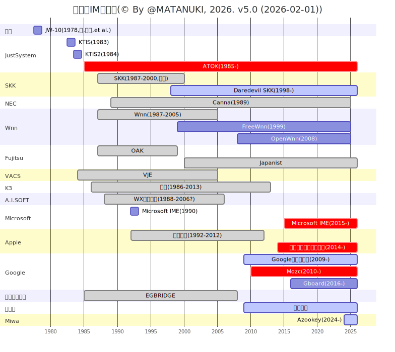

# History of Japanese Input Method

日本語の文字入力方式（かな入力、ローマ字入力、フリック、音声、AI予測変換など）の歴史を、可能な限り一次資料に近い形で時系列・系譜図としてまとめようとしているプロジェクトです。

## 貢献・情報提供のお願い

この分野は一次資料が非常に散逸しており、個人の記憶や古い雑誌・カタログが重要な情報源となっています。
開発に携わった方々などからの情報を受け付けております。

* send-pr
* Issue にスレッド立てて情報投稿

Twitterで御連絡を頂くのも歓迎しております。

## License
This work is licensed under CC BY 4.0. 
See [LICENSE](LICENSE) file for details.

## References

### JW-10

- Japanese Word Processor {JW-10}, Tsutomu Kawada et al., Proceedings of COMPCON Fall 1979, undefined 1979
- Japanese Word Processor, Tsutomu Kawada and Shin-ya Amano, Proceedings of the 6th International Joint Conference on Artificial Intelligence (IJCAI-79), 1979
- The Japanese Word Processor {JW-10}, Koji Kodama et al., Information Processing 80, Proceedings of IFIP Congress 80, 1980
- かな漢字変換における局所意味分析, 天野真家, 昭和55年電子通信学会総合全国大会, 1980
- Japanese Word Processor, Ken-ichi Mori et al., 1983
- 日本語ワードプロセッサのユーザインタフェース設計, 土井美和子, 第11回システムシンポジウム講演論文集, 1985
- From Kana to Kanji: Word Processing in Japan, Ken-ichi Mori and Tsutomu Kawada, IEEE Spectrum 27(8):46--48, undefined 1990
- 評価実験に基づいたエンドユーザ向けサマリノートの作成, 土井美和子, Progress in Human Interface 1:27--34, 1992
- 漢字・日本語処理技術の発展：日本語ワードプロセッサの誕生とその歴史, 天野真家 and 森健一, 情報処理 43(11), undefined 2002
- 日本語ワープロが製品化されるまで, 土井美和子, 通信ソサイエティマガジン 5(16):74--79, 2011
